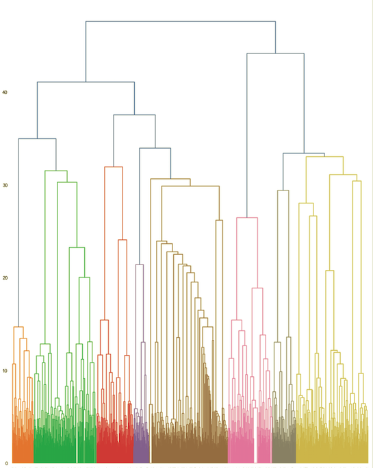
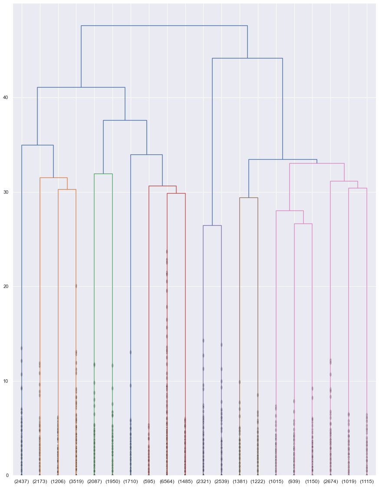

# agglomerative-fragrance-clustering
Hierarchical agglomerative clustering on fragrance accords

        
  

## Table of contents
* [General info](#general-info)
* [Technologies](#technologies)
* [Setup](#setup)
* [Screenshots](#screenshots)
* [Status](#status)

## General info
Unsupervised machine learning project with hierarchical agglomerative clustering performed on different female fragrances.

## Technologies
Project is created with Python - version: 3.8.5.

Python libraries:
* scipy - version 1.5.0
* scikit-learn - version 0.23.2
* pandas - version 1.1.1
* numpy - version 1.19.1
* matplotlib - version 3.3.1
* seaborn - version 0.10.1
  
## Setup

Input data: result2.csv, this is the end result of the https://github.com/katarzynajanicka/fragrance-clustering project.

Output data: hierarchical-clustering.ipynb

## Screenshots

## Results

Dendrogram:

Dendrogram with non-singleton clusters contracted into leaf nodes:

**Conclusions**

Agglomerative hierarchical clustering technique turned out be a better approach than K-means++ clustering (see: https://github.com/katarzynajanicka/fragrance-clustering). This is due to the fact that different perfume fragrances usually have the same notes.

According to the results of the analysis, the optimal number of clusters is twenty.

## Status
Project is in progress.
