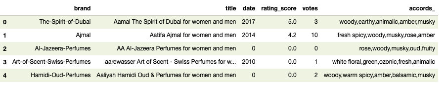
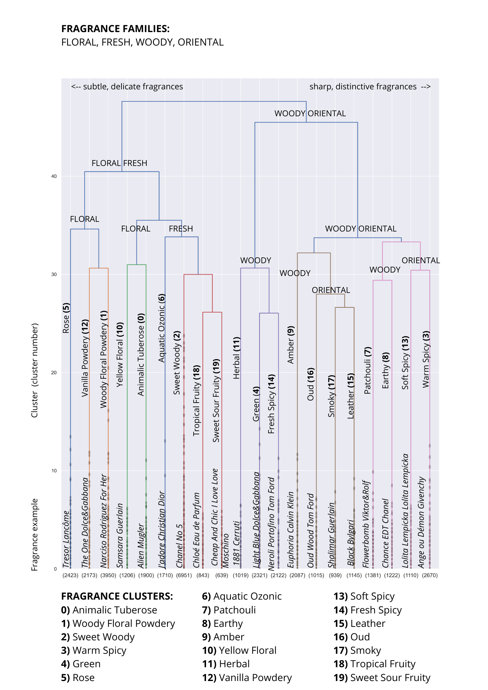

# agglomerative-fragrance-clustering
Hierarchical agglomerative clustering on fragrance accords

        
  

## Table of contents
* [General info](#general-info)
* [Technologies](#technologies)
* [Setup](#setup)
* [Results](#results)
* [Status](#status)

## General info
Unsupervised machine learning project with hierarchical agglomerative clustering performed on different female fragrances.

## Technologies
Project is created with Python - version: 3.8.5.

Python libraries:
* scipy - version 1.5.2
* scikit-learn - version 0.23.2
* pandas - version 1.1.1
* numpy - version 1.19.2
* matplotlib - version 3.3.1
* seaborn - version 0.11.0
  
## Setup

Input data: result.csv, this is the end result of the https://github.com/katarzynajanicka/fragrance-clustering project.

Output data: 
* hierarchical-clustering.ipynb (Jupyter notebook)
* hierarchical_result.csv (end result)

## Results

**Data structure**

**Dendrograms**

**Hierarchical clustering**

**Cluster description by top accords**

**Most popular fragrances**

**Most popular fragrances by cluster**

**Most popular fragrances by brand**

**Conclusions**

Agglomerative hierarchical clustering technique turned out be a better approach than K-means++ clustering (see: https://github.com/katarzynajanicka/fragrance-clustering). This is due to the fact that different perfume fragrances usually share the same notes. It is not unusual for a fragrance to have accords from two or three fragrance families (Floral, Fresh, Woody, Oriental).

## Status
Project is finished.
